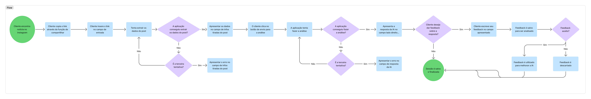

# Resolução das Guiding Questions

Este documento é destinado ao registro das respostas, decisões técnicas e alinhamentos de equipe para cada uma das perguntas orientadoras do projeto.

---

## 1. Dados

### 1.1. Qual será o formato de dado recebido do usuário?

* **Decisão:** Link de post de Instagram
* **Detalhes Técnicos:** Link copiado diretamente do botão de "compartilhamento" da plataforma Instagram.

### 1.2. De qual modo as notícias das nossas fontes divergem das encontradas no Instagram?

* **Resposta / Diagnóstico:**
* **Exemplos Observados:**

### 1.3. De quais fontes vamos obter nossos dados base e como validar sua confiabilidade?

* **Fontes Base Definidas:** [Utilizaremos o Portal de Dados Aberto do TSE](https://dadosabertos.tse.jus.br/dataset/candidatos-2026)
* **Critérios / Protocolo de Validação:**

---

## 2. Usuário

### 2.1. Como será o fluxo de uso da nossa aplicação?

O usuário acessa a plataforma e insere a informação suspeita utilizando o link do post disponibilizado na plataforma.

Então o sistema valida o formato da mídia recebida (extraindo os textos importantes) e espera uma confirmação do usuário.

Então o modelo busca e compara a alegação com os planos de governo oficiais e diretrizes registradas no repositório oficial (TSE).

Então a aplicação processa os dados e classifica a alegação.

Então o usuário visualiza o veredito com a justificativa detalhada e tem a opção de avaliar a resposta recebida (feedback) ou realizar uma nova consulta.

Diagrama de Fluxo de Uso:
 

### 2.2. Como vamos receber feedbacks do usuário?

* **Canais / Mecanismos de Coleta:** Extrairemos o feedback do usuário através de um formulário disponibilizado após a resposta fornecida pelo modelo.
* **Métricas ou Perguntas de Avaliação:** 

---

## 3. Modelo

### 3.1. Quais métricas vamos apresentar para explicar o pensamento da IA?

* **Abordagem de Explicabilidade (XAI):**
* **Métricas e Indicadores Exibidos na Interface:**

### 3.2. Como vamos evitar que o modelo seja enviesado?

* **Estratégias de Mitigação de Viés (dados e validação):**
* **Processo de Auditoria e Testes:**

### 3.3. Como vamos hospedar o modelo?

* **Infraestrutura / Plataforma Escolhida:**
* **Estimativa de Custos e Latência:**

---

## 4. Ética

### 4.1. Como vamos diferenciar notícias políticas de informações da vida pessoal do político?

* **Critérios de Escopo e Filtro:**
* **Tratamento de Casos Limítrofes (Diretrizes de Moderação):**

---

## 5. Produção

### 5.1. Qual modelo vamos utilizar como base?

* **Modelo Selecionado:** Pixtral-12B-2409
* **Justificativa da Escolha:**
A escolhemos o [Pixtral-12B-2409](https://huggingface.co/mistralai/Pixtral-12B-2409) pois o modelo demonstra excelente desempenho na compreensão contextual do português. No escopo da aplicação o modelo atuaria com precisão nas correlações semânticas entre as descrições textuais das postagens do Instagram e as propostas oficiais arquivadas do TSE, identificando distorções e inconsistências sutis de discurso. Além disso, por ser uma arquitetura multimodal nativa, a escolha preserva a flexibilidade técnica, permitindo processar imagens e prints diretamente em etapas futuras do projeto sem a necessidade de substituição da infraestrutura.

   